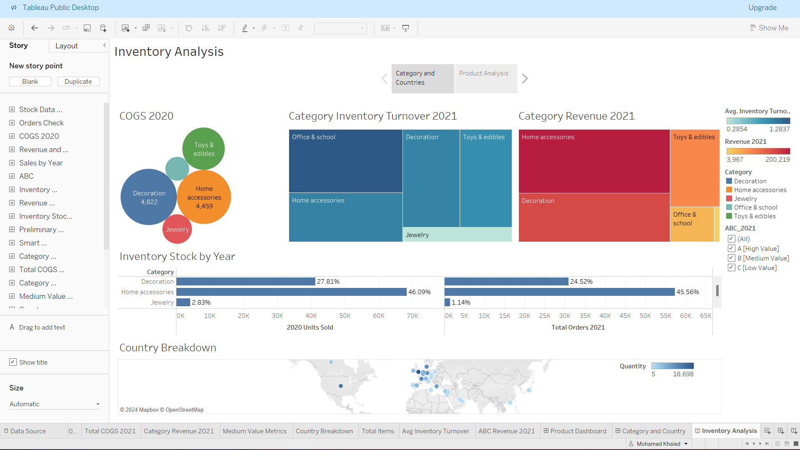

# Inventory-Analysis
This project provides a comprehensive analysis of inventory data using Tableau to help businesses optimize their stock management.
Key Features:
  
  - Interactive dashboards showcasing inventory performance metrics.
  - Visual representations of inventory turnover, demand patterns, and stock coverage.
  - Drill-down capabilities for deeper analysis by product categories, locations, or time periods.
  - Customizable filters to explore specific inventory segments and scenarios.

Ideal for supply chain managers, operations teams, and business analysts to make data-driven decisions and improve overall inventory management strategies.

https://m97khaled.github.io/Inventory-Analysis/

